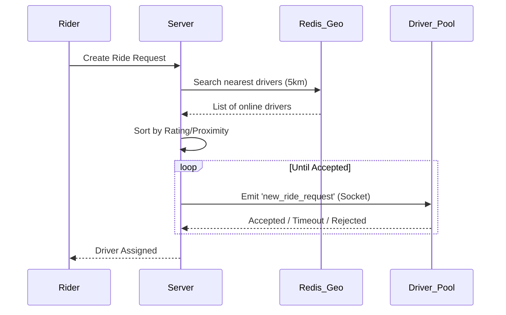
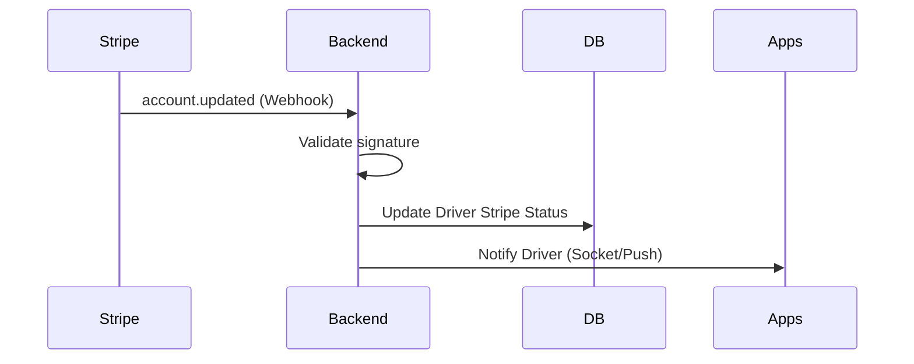

# System Architecture Overview

## Clean Architecture Structure
```text
lib/
├── core/
│   ├── config/ (EnvConfig)
│   ├── network/ (Dio/Rest Client)
│   ├── socket/ (SocketService abstraction)
│   ├── location/ (Throttling logic)
│   ├── services/ (Notification, Crashlytics)
│   ├── logger/ (Log management)
│   └── utils/ (FareCalculator)
│
├── data/
│   ├── models/ (RiderModel, DriverModel)
│   ├── datasources/ (RemoteDataSource)
│   └── repositories/ (Data implementation)
│
├── domain/
│   ├── entities/ (Rider, Driver, Ride)
│   ├── repositories/ (Interface definition)
│   └── usecases/ (MatchingEngine, RequestRide)
│
├── presentation/
│   ├── rider/
│   │   ├── auth/
│   │   ├── ride_request/
│   │   ├── ride_tracking/
│   │   └── payment/
│   │
│   ├── driver/
│   │   ├── onboarding/
│   │   ├── stripe_connect/
│   │   ├── dashboard/
│   │   ├── ride_management/
│   │   └── earnings/
│   │
│   └── shared/ (Common UI widgets)
│
└── injection_container.dart (DI)
```

## High-Level Data Flow
1. **UI Layer** triggers a `UseCase`.
2. **Domain Layer** (UseCase) calls a method in the `Repository` interface.
3. **Data Layer** (Repository implementation) fetches data from `RemoteDataSource`.
4. `RemoteDataSource` calls the `NetworkClient` (API or Socket).
5. Data flows back upstream, converted from `Model` (Data) to `Entity` (Domain).

## Distributed Matching Workflows


## Payment Webhook Flow

